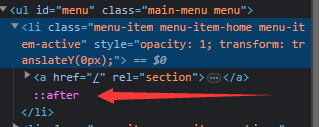
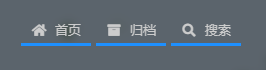
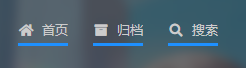

# Step1: 建立元素

可以通过写html或者通过css建立伪元素，只要有元素可以设置高度和颜色就行

在这里我选用css伪元素，原因就是方便

## 建立方法：

name::before/after{}

### 例子：

例如我要在`<li>`这个标签内的子元素的最末尾加个伪标签



那么写法就是

```css
li::after{
  content:''; // 必须定义，否则不生效
}
```

# 2. 画线

设置个高和颜色就行就行，很简单

```css
height:3px;
background-color:dodgerblue;
display:block;
```

此时我们得到的效果是这样的



## 插个题外话，讲下这里我遇到的一个坑

在html中，存在一个父子之间的关系，我把它想象成一个容器，子元素的大小不能突破父元素

原本我是在`<a>`标签中加元素，但是这样做出来的动画感觉怪怪的



原因就是父元素`<a>` 设置了偏移(padding)，要求子元素之间都有个间隔

# 3. 添加动画

接下来用的是 Stylus (styl) 的语法，正常的css应该不是这么写

我们先用 `transform` 给元素设置下坐标

`transform:translateX(-100%)`

再设置下动画

```css
transition-delay: 0s; // 开始之前等待时间
transition-duration: .2s; // 动画时长
transition-timing-function: ease-in-out; // 加速度曲线
```

设置好动画以后，再绑定一下事件

当鼠标在元素焦点时（称之为hover）设置下元素坐标

```css
li:hover::after{
  transform:translateX(0);
}
```

# 4.设置元素超出属性

`overflow clip` 

当元素超出父元素时，多余的部分裁剪掉

这个要设置在父元素，设置在伪元素会出问题

## 在这里遇到的坑

使用 `overflow hidden` 会使元素偏移

# 5. （可选）设置元素可见

虽然已经设置overflow使元素超出父元素时不可见了，但是防止出bug还是加一下比较好

具体看源码吧


# 源码

```stylus
li.menu-item{
  overflow clip // 设置超出
  &::after{
    content ''
    background-color dodgerblue
    display block
    height 3px
    transform translateX(-100%)
    visibility hidden // 隐藏元素
    the-transition() // 主题里面已经自带设置好的函数，直接调用就行
  }

  &:hover::after{
    transform translateX(0)
    visibility visible // 显示元素
  }
}
```

## 参考链接

[overflow - CSS：层叠样式表 | MDN](https://developer.mozilla.org/zh-CN/docs/Web/CSS/overflow)

[transform - CSS：层叠样式表 | MDN](https://developer.mozilla.org/zh-TW/docs/Web/CSS/transform)

[::after (:after) - CSS：层叠样式表 | MDN](https://developer.mozilla.org/zh-CN/docs/Web/CSS/::after)

[transition - CSS：层叠样式表 | MDN](https://developer.mozilla.org/zh-CN/docs/Web/CSS/transition)

