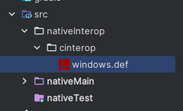
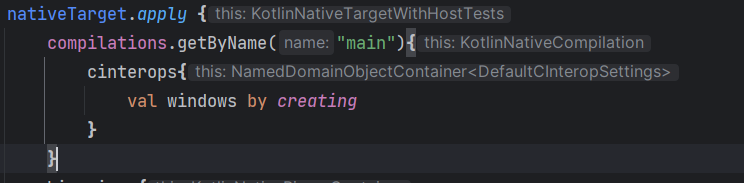

# 前言

[上篇文章]() 我们初次认识了 Kotlin/Native。这篇文章则为对视频中内存操作的实践

# 主要步骤

1. 通过 `CreateToolhelp32Snapshot` 遍历进程并获取进程id

~~写文章好累，贴个代码记录下算了，应该不会有人认真看，有时间再改文章吧~~

# 代码

```kotlin
private fun getProcessID(processName: String): UInt{
    memScoped {
        val snapshot = CreateToolhelp32Snapshot(TH32CS_SNAPPROCESS.toUInt(),0U)
        val processEntry = alloc<PROCESSENTRY32W>()
        processEntry.dwSize = sizeOf<PROCESSENTRY32W>().convert()
        if(Process32FirstW(snapshot,processEntry.ptr) != 0){
            do {
                val name = processEntry.szExeFile.toKString()
                if(processName == name){
                    CloseHandle(snapshot)
                    return processEntry.th32ProcessID
                }
            }while (Process32NextW(snapshot,processEntry.ptr) != 0)
        }
        CloseHandle(snapshot)
        return 0U
    }
}
```

# 遇到的坑

## 1.没有 `CreateToolhelp32Snapshot` 方法

### 原因：

默认没有导入 `tlhelp32.h` 头文件

### 解决办法：

1. 创建路径`nativeInterop/cinterop` 并放入 `windows.def` :

```
package = platform.windows
headers = wtypes.h minwindef.h windows.h commctrl.h dwmapi.h shlobj.h shlwapi.h shobjidl.h \
    urlmon.h usp10.h uxtheme.h vfw.h wininet.h winsock2.h ws2tcpip.h ws2def.h windows.h tlhelp32.h
compilerOpts = -DUNICODE -DWINVER=0x0601 -D_WIN32_WINNT=0x0601 -DWINAPI_FAMILY=3 -DOEMRESOURCE \
    -Wno-incompatible-pointer-types -Wno-deprecated-declarations
linkerOpts = -lcomctl32 -lcrypt32 -lshlwapi -lshell32 -limm32 -lusp10 -lwininet -lgdi32 -luser32 -lkernel32 -lbcrypt -luuid -ldwmapi
noStringConversion = LoadCursorA LoadBitmapA LoadIconA LoadImageA LoadCursorW LoadBitmapW LoadIconW LoadImageW
depends = posix
```

路径图 :



#### windows.def 的来源：

[windows.def](https://github.com/JetBrains/kotlin/blob/master/kotlin-native/platformLibs/src/platform/mingw/windows.def) 在此文件的 `headers` 后 加入 `windows.h tlhelp32.h` 


2. 在 `build.gradle.kts` 加入:

   ```kotlin
   compilations.getByName("main"){
       cinterops{
           val windows by creating
       }
   }
   ```



## 2. 获取不到进程

原先使用的是 `Process32First` 和 `Process32Next ` 这两个方法去处理 `CreateToolhelp32Snapshot` 在 `Process32First` 的得到的结果为0，正常来讲不应该为0。随后我在YouTrack发了[Issue](https://youtrack.jetbrains.com/issue/KT-60477)

得到的解决办法是更换方法：

- PROCESSENTRY32 -> PROCESSENTRY32W

- *Process32First -> Process32FirstW*

- *Process32Next -> Process32NextW*

  
  
  在此感谢帮忙研究问题的这几位朋友

# 参考文章

[Create an app using C Interop and libcurl](https://kotlinlang.org/docs/native-app-with-c-and-libcurl.html)
