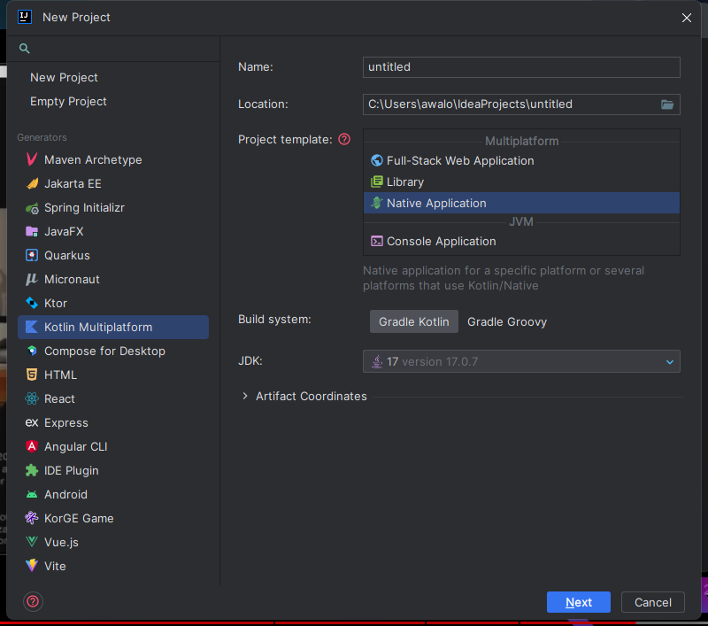



在这个视频中，讲者使用 Kotlin/Native 对游戏进行内存注入

看了这个视频，让我发现了 Kotlin/Native 这个神奇玩意，再加上我是Kotlin的爱好者，所以就有兴趣去尝试了下。

# 环境搭建

使用 Intellij Idea 可以快速对 Kotlin/Native 进行环境搭建

# 优点

- 可以与C互操作，因此用C写的代码可以迁移到 Kotlin/Native

# 缺点

- 目前 Kotlin/Native 的库比较少，很多库需要自己造

- 打包慢

  
